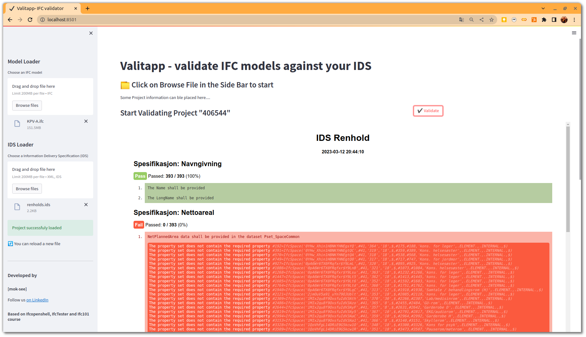
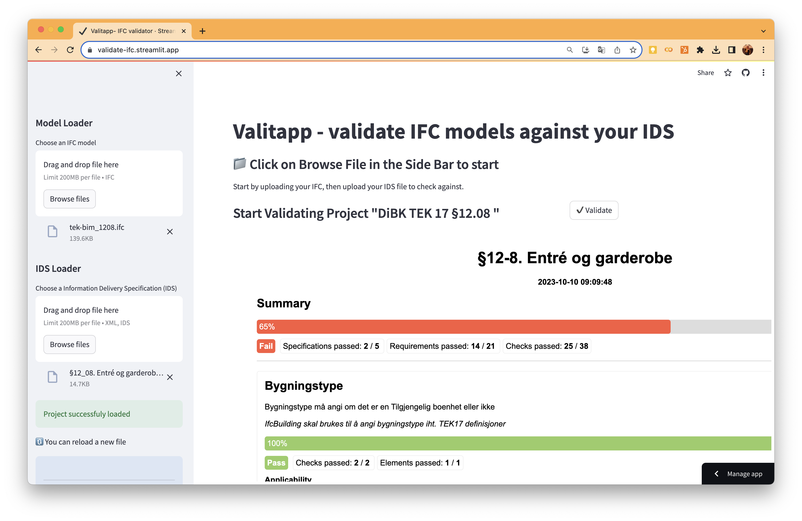

# Valitapp
A streamlit app to validate IFC models against IDS. 

# Prototype to test out validation of IFC files using IDS

The app is heavily based on the IfcTester project and Ifcopenshell and serves as a prototype in a project initiated by the Norwegian Building Authority. 

The IDS is a demo for two specifications relevant for cleaning use case for BIM. 

And tested on a model provided by a Norwegian Property Owner. 

## § 12-8. Entré og garderobe demo

